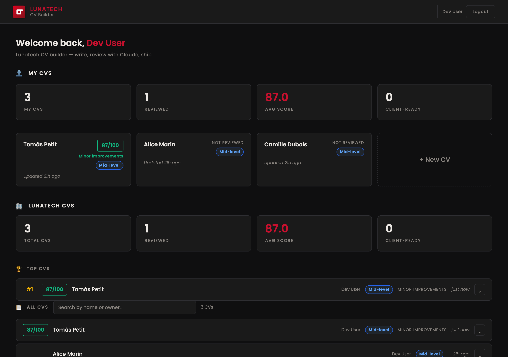
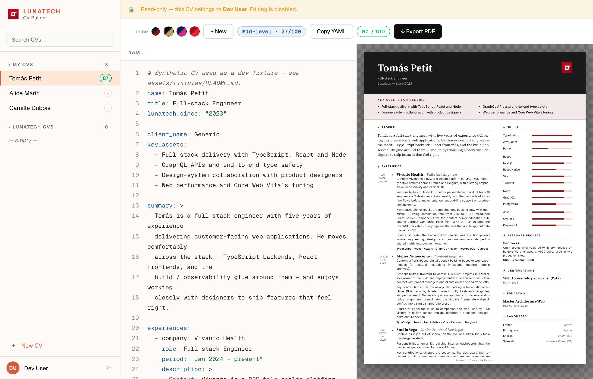
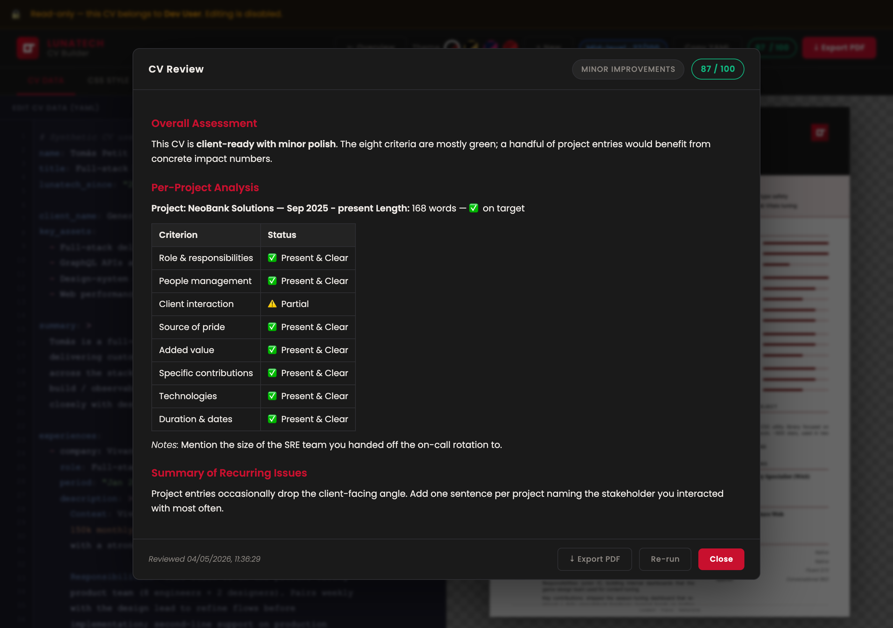
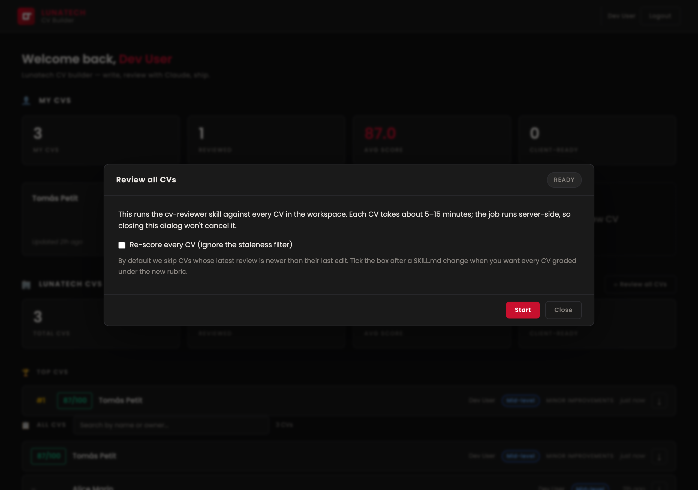
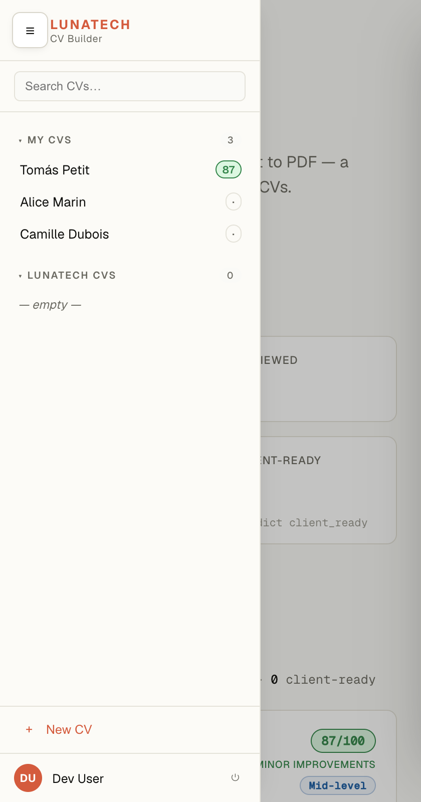

# CV Builder

A small web app for editing Lunatech consultant CVs as YAML and exporting branded PDFs. The frontend is a single static HTML page with a live preview; the backend is a Rust service that persists CVs to Postgres and generates the PDF in-process via the [Typst](https://typst.app) library.

The CV layout follows the 8-criteria rubric of the `cv-reviewer` Anthropic skill — every project entry should answer the questions a client naturally asks (role, team size, client interaction, contributions, value, technologies, dates, source of pride).

## Screenshots

| | |
| - | - |
|  | **Overview** — landing page with company-wide stats, the Top CVs ranking and the searchable "All CVs" catalog. |
|  | **Editor** — YAML on the left, live HTML preview on the right. The PDF render mirrors the preview pixel-for-pixel. |
|  | **Claude review** — the `cv-reviewer` skill grades each project against the 8 criteria, returns a 0–100 score and a per-section report. Opens as a right-side slide-over so the workspace stays in context. |
|  | **Batch review** (admin) — re-grades every CV in the workspace via SSE; live progress with succeeded / failed counts. |
|  | **Mobile** — below 900px the sidebar collapses into a left drawer with a hamburger trigger; the editor split flips to YAML-on-top-of-preview below 768px. |

> Drop new screenshots into [`docs/screenshots/`](docs/screenshots/) using those exact filenames.

## Quick start

```bash
make setup    # docker-compose up + cargo build (one-time)
make dev      # runs the app on http://127.0.0.1:3000
```

Open <http://127.0.0.1:3000>. On a freshly-cloned repo with no `.env.local`, the server boots in **dev mode** — no Keycloak, no Anthropic — and seeds three fixture CVs (Camille / Alice / Tomás) into the empty database so the overview is populated on first load. The fixtures live under [`assets/fixtures/`](assets/fixtures/) and are only seeded when **all three** are true: the `cvs` table is empty, Keycloak isn't configured, **and** `DEV_SEED_FIXTURES=1` is set (the Makefile sets it for `make dev`; production never does, so prod redeploys cannot trigger seeding even if a Keycloak env var disappeared).

Edit the YAML on the left, watch the preview update on the right. **+ New** starts a blank CV, **Save** persists it server-side, **Export PDF** saves and opens the rendered PDF in a new tab.

To enable Claude reviews and Keycloak login locally, copy your secrets into `.env.local` (gitignored):

```
ANTHROPIC_API_KEY=sk-ant-…
KEYCLOAK_URL=https://keycloak.example.com
KEYCLOAK_REALM=...
KEYCLOAK_CLIENT_ID=...
ADMIN_EMAILS=you@example.com,colleague@example.com
```

`make dev` sources `.env.local` automatically before `cargo run`. Useful Make targets:

| Target | What it does |
| ------ | ------------ |
| `make setup` | First-time bootstrap: Postgres up + cargo build |
| `make dev` | Source `.env.local` and run the server |
| `make test` | `cargo test` (Postgres must be up) |
| `make reset` | Drop + recreate the `cvbuilder` database (re-seeds fixtures on next `make dev`) |
| `make db-up` / `make db-down` | Start / stop the Postgres container |
| `make screenshots` | Capture the four README screenshots via headless Chrome (dev server must be running) |

## How it works

```
                                 ┌──────────────────────┐
                                 │  frontend/index.html │
                                 │  YAML editor + live  │
                                 │  HTML preview        │
                                 └─────────┬────────────┘
                                           │  fetch JSON
                                           ▼
                                 ┌──────────────────────┐
                                 │  Rust backend (axum) │
   serves the static frontend ◄──┤                      │
                                 │  /api/cvs   CRUD     │
                                 │  /api/cvs/:id/pdf    │
                                 └─────────┬────────────┘
                                           │
                          ┌────────────────┼─────────────────┐
                          ▼                                  ▼
                 ┌─────────────────┐                ┌────────────────────┐
                 │   Postgres 16   │                │  Typst library     │
                 │   table: cvs    │                │  assets/cv.typ +   │
                 │   stores YAML   │                │  YAML -> PDF bytes │
                 └─────────────────┘                └────────────────────┘
```

The frontend stores nothing locally — every save is a round trip to the backend. The browser preview and the PDF are produced by two independent renderers (CSS in the browser, Typst on the server) sharing the same YAML schema.

## Project layout

```
cv-builder/
├── Cargo.toml                 Rust dependencies
├── docker-compose.yml         Postgres service
├── migrations/
│   └── 0001_init.sql          schema
├── assets/
│   └── cv.typ                 Typst template (PDF look)
├── frontend/
│   └── index.html             YAML editor + preview + UI
└── src/
    ├── main.rs                axum router, app wiring
    ├── db.rs                  sqlx queries
    ├── handlers.rs            HTTP handlers
    └── pdf.rs                 YAML -> Typst -> PDF
```

## API reference

All endpoints accept and return JSON unless noted otherwise.

| Method | Path                              | Body                | Returns                                 |
| ------ | --------------------------------- | ------------------- | --------------------------------------- |
| GET    | `/api/cvs`                        | -                   | `[{id, name, updated_at}, ...]`         |
| POST   | `/api/cvs`                        | `{"yaml": "..."}`   | `{id}` (HTTP 200)                       |
| GET    | `/api/cvs/{id}`                   | -                   | `{id, name, yaml, updated_at}`          |
| PUT    | `/api/cvs/{id}`                   | `{"yaml": "..."}`   | HTTP 204                                |
| DELETE | `/api/cvs/{id}`                   | -                   | HTTP 204                                |
| GET    | `/api/cvs/{id}/pdf?theme=cosmic`  | -                   | `application/pdf` bytes                 |

The `name` column shown in the list is extracted from the YAML's top-level `name:` key on save. If the YAML has no `theme:` field, the query string `?theme=` decides which palette the PDF uses (`cosmic` is the default; `luxe` and `opera` are the other two).

### Example

```bash
# Create
ID=$(curl -s -X POST http://localhost:3000/api/cvs \
  -H 'content-type: application/json' \
  -d '{"yaml": "name: Test\ntitle: Engineer\nlunatech_since: \"2024\""}' \
  | jq -r .id)

# Read back
curl -s http://localhost:3000/api/cvs/$ID

# Download PDF
curl -s "http://localhost:3000/api/cvs/$ID/pdf?theme=luxe" -o cv.pdf
```

## YAML schema

Top-level keys consumed by both renderers:

```yaml
name: ...                   # required, used for the list view
title: ...                  # role / specialisation
lunatech_since: "2020"      # year as a string
client_name: ...            # shown in the "Key Assets for ..." capsule
key_assets:                 # bullet list shown in the capsule
  - ...
summary: >                  # italic intro paragraph
  ...
theme: cosmic | luxe | opera   # optional, overrides the ?theme= query

experiences:                # professional history
  - company: ...
    role: ...
    period: ...
    description: >
      ...
    tags: [...]

projects:                   # personal projects
  - name: ...
    description: ...
    tags: [...]
    link: ...               # optional URL fragment

skills:                     # grouped skill bars (level 1-5)
  - group: Languages
    items:
      - { name: Scala, level: 5 }

education:
  - school: ...
    degree: ...
    year: "..."

certifications:
  - name: ...
    issuer: ...
    year: "..."

languages:
  - language: ...
    level: ...
```

Unknown keys are ignored. Missing optional keys render as nothing.

## Themes

Three palettes ship in the Typst template and the HTML CSS:

| Theme  | Header colour | Accent     |
| ------ | ------------- | ---------- |
| cosmic | navy          | pink       |
| luxe   | black         | gold       |
| opera  | deep red      | bright red |

The browser theme switcher updates the live preview only; the PDF gets the theme via the `?theme=` query (set automatically by the **Export PDF** button) or via the `theme:` key in the YAML if present.

## Editing the visuals

There are two independent renderers. Changing one without the other will make the browser preview drift from the PDF.

- **Browser look** — `frontend/index.html` (CSS at the top of the file, `renderCV()` for the structure).
- **PDF look** — `assets/cv.typ` (Typst template; the Rust side injects a `cv-data` dict at the top of this file before compiling).

To extend the schema, you typically edit four places: the YAML default in `frontend/index.html`, the `renderCV()` function in the same file, the Typst template, and (sometimes) the schema docs above.

## Tests

```bash
docker-compose up -d   # Postgres must be running
cargo test
```

48 tests cover the full feature set:

- **`src/pdf.rs` unit tests** — YAML to Typst dict serialisation (string escaping, sequences, nested mappings, null/bool/numbers, key sanitisation), and `render()` against minimal / full / invalid YAML, every theme, special characters, and the YAML-overrides-query precedence rule.
- **`src/handlers.rs` unit tests** — `extract_name` for missing keys, non-string values, invalid YAML, and quoted strings.
- **`tests/api.rs` integration tests** — every HTTP route end-to-end against a real Postgres (each `#[sqlx::test]` runs against a fresh scratch database created on the cluster pointed at by `DATABASE_URL`):
  - `GET /api/cvs` empty + ordering by `updated_at DESC`
  - `POST /api/cvs` happy path, name extraction, empty/whitespace rejection, missing `name` key
  - `GET /api/cvs/:id` 404 and 400 (invalid UUID)
  - `PUT /api/cvs/:id` happy path, 404, empty body rejected, `updated_at` bump
  - `DELETE /api/cvs/:id` happy path, 404
  - `GET /api/cvs/:id/pdf` happy path, content-type, content-disposition slug, all three themes, unknown theme fallback, 404, minimal YAML

`DATABASE_URL` is set via `.cargo/config.toml`, so `cargo test` works as long as Postgres is up — no manual env var needed.

## Stack notes

- **Rust 2024**, `axum` 0.8, `sqlx` 0.8 (Postgres), `typst` 0.14, `typst-pdf` 0.14, `typst-kit` 0.14.
- We use the **runtime sqlx queries** (`sqlx::query` + `.bind`) instead of the compile-time `query!` macro — no need for a live `DATABASE_URL` at build time.
- Typst is used as a library: a Rust function generates a `#let cv-data = (...)` preamble from the parsed YAML, prepends it to `assets/cv.typ`, and feeds the result to `typst::compile`. No subprocess.
- The frontend has no build step; it pulls `js-yaml` and the Poppins font from CDNs.

## Troubleshooting

**`status=500 typst compile failed`** — set `CV_DEBUG_TYPST=1` before `cargo run` and re-trigger the PDF route. The generated source is dumped to `/tmp/cv-builder-debug.typ`; you can compile it with `typst compile /tmp/cv-builder-debug.typ /tmp/out.pdf` to see the underlying Typst error.

**Fonts look wrong in the PDF** — the template requests `Poppins` and `Inter`, which are not bundled. Typst falls back to a system serif/sans. Drop `.ttf` files into `assets/fonts/` and wire them through `typst_kit::fonts::FontSearcher` to fix.

**`could not find Cargo.toml`** — make sure your shell is `cd`'d into `cv-builder/` before running `cargo run`.

**Postgres connection refused** — `docker-compose ps` should show `cv-builder-pg` up. If it isn't, `docker-compose up -d` and wait for `pg_isready -h localhost -p 5433 -U cvbuilder`.
